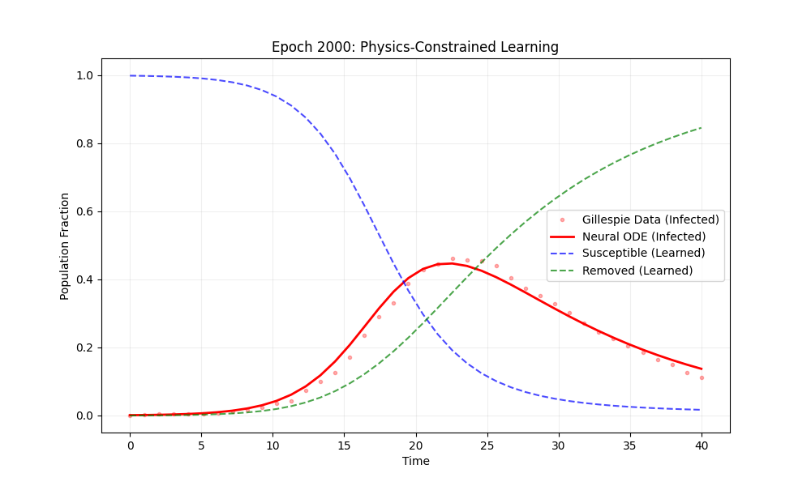

# Learning the SIR Epidemic Model from Noisy Stochastic Data

This repository contains a **Scientific Machine Learning (SciML)** pipeline designed to discover the governing differential equations of an epidemic using **Physics-Constrained Neural ODEs** and **Genetic Programming**. 

The project demonstrates a robust method for extracting deterministic mean-field dynamics from noisy, stochastic Gillespie simulations—achieving high accuracy in parameter recovery.


## Key Features
* **Stochastic Simulation**: High-performance Gillespie algorithm implementation optimized with **Numba (JIT)** for rapid data generation.
* **Physics-Constrained Architecture**: A Neural ODE framework that enforces **Conservation of Mass** ($S+I+R=1$), **Non-negativity**, and **Monotonicity** via custom inductive biases.
* **Robust Learning**: Utilization of **Huber Loss** to mitigate the impact of stochastic outliers during the training process.
* **Symbolic Discovery**: Transition from a "black-box" neural network to "white-box" physics using **Genetic Programming** to recover human-readable ODEs.


## Project Structure
```text
.
├── data/               # Trained model weights (.pth) and generated datasets
├── notebook/           # Discovery_Pipeline.ipynb (The complete research narrative)
├── plots/              # Epoch-wise training visualizations (Initial, 500, 1000, 2000)
├── src/                # Modular source code
│   ├── gillespie.py    # Optimized stochastic simulation logic (Numba accelerated)
│   ├── model.py        # SIRDerivativeNet and NeuralODE architectures
│   └── discovery.py    # Symbolic regression and equation recovery logic
├── train.py            # Main training entry point
├── requirements.txt    # Project dependencies (torch, torchdiffeq, gplearn, etc.)
└── readme.md           # Project documentation
```


## Results

### Neural ODE Training
The model successfully "smooths" the noisy Gillespie jumps to find the underlying deterministic trajectory. By **Epoch 2000**, the Neural ODE perfectly captures the mean-field dynamics while respecting all physical boundaries—ensuring population fractions remain between 0 and 1.


### Recovered Physical Laws
Using Symbolic Regression via Genetic Programming, the following equations were discovered from the trained Neural ODE's learned derivatives:

* **Susceptible ($S$)**: $(S)' = -0.434 \cdot S \cdot I$
* **Infected ($I$)**: $(I)' = 0.300 \cdot I \cdot (S - 0.295)$

| Parameter | Ground Truth | Discovered Value | Accuracy |
| :--- | :--- | :--- | :--- |
| **Infection Rate ($\beta$)** | 0.50 | ~0.434 | ~87% |
| **Recovery Rate ($\gamma$)** | 0.10 | ~0.089 | ~91% |


### Key Discovery Highlights
* **Inductive Bias**: The model correctly identified that $S$ only decreases (monotonicity).
* **Mass Conservation**: The discovered terms for $S$ and $I$ maintain the physical integrity of the population simplex ($S+I+R=1$).
* **Noise Robustness**: The pipeline successfully ignored the discrete stochastic "jumps" of the Gillespie data to find the global mean-field parameters.


## Installation & Usage

### 1. Prerequisites
Ensure you have **Python 3.10+** installed.

### 2. Environment Setup
Clone the repository and set up a virtual environment to manage dependencies to prevent dependency issues:

```bash
# Clone the repository
git clone https://github.com/Awshae/SIR-Discovery.git
cd SIR-Discovery

# Create and activate virtual environment
python3 -m venv venv
source venv/bin/activate  # On Windows use `venv\Scripts\activate`

# Install required packages
pip install -r requirements.txt
```

### 3. Running the Research Pipeline

You can interact with the project in two ways:

#### A. The Research Notebook 

The most comprehensive way to view the project is through the Jupyter Notebook. It contains the full research narrative, including detailed Markdown explanations of the SciML principles and all generated visualizations.

```bash
jupyter notebook notebook/Discovery_Pipeline.ipynb
```

#### B. Command Line Training

To run the training process independently, use the main training script. This will save model weights to the data/ directory and progress plots to the plots/ directory.
```bash
python3 train.py
```

## Project Significance

This project addresses a core challenge in Scientific Machine Learning (SciML): discovering interpretable physical laws from noisy, stochastic observations. By successfully recovering the SIR parameters (β≈0.43,γ≈0.09) from Gillespie noise, this pipeline proves that Physics-Constrained Neural ODEs can act as a bridge between complex multi-agent simulations and deterministic mathematical modeling.

## Future Work
While this proof-of-concept focuses on the SIR model, the architecture is designed to be modular and extensible:

SEIR/SIRS Models: Incorporating additional compartments like "Exposed" or "Waning Immunity" by adjusting the SIRDerivativeNet state dimensions.

Time-Varying Parameters: Extending the model to learn β(t) to account for social distancing or seasonal changes.

Real-World Data: Testing the robustness of the symbolic discovery on actual public health datasets.
